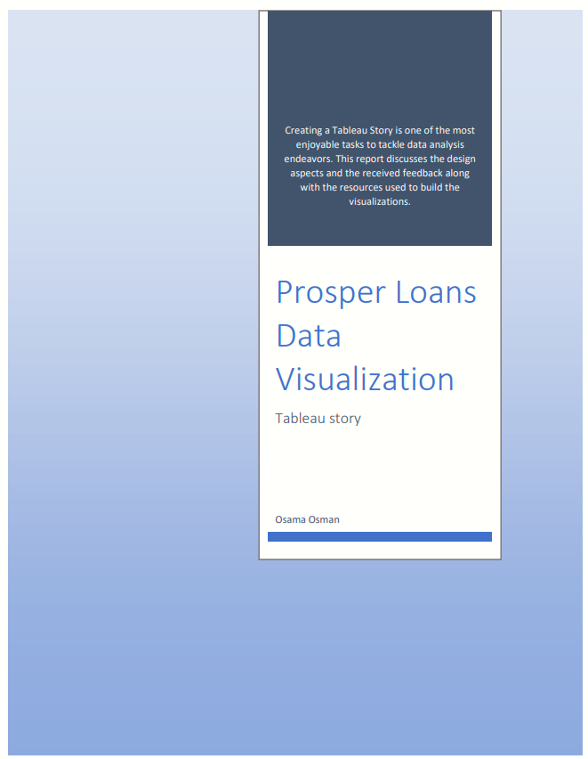

## Contents

1. [ Background. ](#bkgrd)
2. [ Design Aspects. ](#dsn)
3. [Feedback. ](#fdbk)
4. [Tableau Public Workbooks](#tabwbs)

# Prosper Loans Data Visualization with Tableau

## Background

This data set contains **113,937** loans with **81** variables on each loan, including loan
amount, borrower rate (or interest rate), current loan status, borrower income, borrower
employment status, borrower credit history, and the latest payment information. worth
noting that the dataset was last updated 03/11/

In this tableau story I tried to explore the following points:

1. Prosper Business and performance trends “by year and by state”.
2. Know about the borrowers to help investors (Lenders) make appropriate decision.

## Design Aspects

Building a tableau story to explain the insights in the dataset, with a narrative smooth
transition from one point to another, I have used the following visualizations elements:

1. Illustrating the progress of Prosper’s business by plotting the number of loan
    listings across the dataset time span from late 2005 to early 2014 on **_a time series_**
    **_line chart_**. This gives the reader a sneak peek into how prosper business grew over
    time and the general trend of their ability to acquire customers. It also accentuates
    the points in time where the number of listings dipped and hit an all-time high level.
    Moreover, the addition of the trend line highlights the general upward trend of
    Prosper business.
2. After Receiving a feedback about the need to see the year over year change in
    volume on listings I added the **_“Year over Year Growth Rate” graph_** by utilizing the
    relevant **_table calculation_**. Actually, it added more insight as it highlights the
    change from previous year and states results in percentage terms for an easy
    comparison. For example: From the first line chart I noticed that there’s a decline in
    2014 first quarter but after implementing the year over year table calculation, I
    noticed that the volume of listings in the first quarter of 2014 is 175% that of the
    same period in 2013.
3. Frequently resorted to **_tree maps_** to encode different measures in relation to
    specific dimension using the area of the rectangle and color gradient encoding for
    the other measure. Harnessing the tooltip capability allowed for richer explanation
    and highlight of the data under discussion.
    
    > **_For example_** ; Investigating the leading motives to borrow by creating a tree map for
    the listing categories. In this map the average volume of the loan was encoded as the rectangle volume that showed a relatively comparable rectangles for some of the categories. Meanwhile the color gradient used to encode the percent of all records for each category showing us that the debt consolidation category contributes the highest percent of loans with an average loan size comparable to other categories like Baby & Adoption and Business. Adding to that the use of the tooltip option enabled conveying more insight about each listing category.

4. Using **_Bar charts_** for categorical dimensions and **_Histograms_** for binning some
    measures to show their frequency distribution. In addition to incorporating the
    color encoding that comes in handy to regroup and classify the variables into
    discrete groups and to include third dimension to the graph.

5. Creating new dimensions through calculated fields enriched the explanation. For
    example; simplifying the loan statuses by first creating the “Loan Status Adjusted”
    dimension to include all the “past dues” loans into “Delinquent” category and then
    adding more simplicity to the grouping by creating “Defaulting Vs Good-standing”
    grouping to classify loans as Bad, Risky and good helped in conveying clearer
    message to the reader over the whole story.

6. establishing Dashboards every now and then within the story enables viewers’
    interaction and motivates them to paly around with the data to explore and learn
    about it.

7. Implementing **_filters based on parameters_** like the **_“Top Occupations in Estimated_**
    **_Net Return”_** allows reader interaction with the visualization.

8. With the number of available measures in the dataset, I got bewildered. To
    overcome this, I have created a multi-measure insight worksheet by implementing
    filter for listing category based on a top n parameter and giving the reader the right
    to decide on the most important measure to incorporate into then visualization, so
    he/she can get the top n occupation in terms of different measures like (average
    proper score or average amount delinquent, etc.) within one or more of the listing
    categories.

9. Trying to spot on the idea of high risk is typically associated with high interest rates
    obtained from the borrowers I have built a dashboard that encompassed:
    i) Scatter plots showing the relation between two numerical variables and
       encoding with color that allowed the addition of other dimensions. That’s what
       was done to depict the relation between borrowing rates and borrowers prosper
       scores; the use of color encoding highlighted the fact that credit grade ratings are
       closely related to prosper score. Moreover, the size encoded the percent of bad
       performing loans within each category.
    ii) In the “Delinquency (Bad Performance) & Borrower APR” plot I opted to use a
       thumbs down shape to reflect the sense of bad performance. The size used to
       encode the percent of bad performing loans within each credit grade rating. And the overall plot conveyed the message that higher borrowing rates is associated with higher percent of bad performing loans.
    iii) Finally, a density plot used to plot the frequency distribution of the different borrowing rates and their pertinent proportions of bad performing loans.

10. Lastly, using table calculations to highlight the difference from average across
    different periods to help the lenders learn about the patterns in the lending yield.
    Adding filters by year and listing category to enable digging deeper into the data.

## Feedback

For the feedback, I have approached two of my MBA colleagues after getting no response
from other channels like Udacity’s student hub and LinkedIn. Collecting their feedback
through face to face meeting was valuable. Their comments were as follows:

1. On the first time series graph. The x-axis name needs to be more descriptive and
    they convinced me to make another graph for the year over year growth rate to
    compares a statistic for one period to the same period the previous year as
    aforementioned in point 2 of the design section.
2. Hiding worksheets and delete others that are not listed in the story.to stave off
    distraction.
3. Changing the filter position on the Prosper loan management dashboard for a better
    readability.
4. Correct the sort order in the “Top Occupations in Estimated Net Return” after as the
    Top N Occupation parameter being toggled.
5. Optimizing buttons and filters on several worksheets e.g. “Multi-Measure insights”
    worksheet and the “Lender Yield - Difference from average by period” worksheet
    with the addition of more filters to the latter for deeper insight within listing
    categories and certain years.

## Tableau Public Workbooks:

1) Version 1: [**Prosper Loans Story**](https://public.tableau.com/views/ProsperLoansStory/Story1?:embed=y&:display_count=yes)

2) Version 2: [**Prosper Loans Story_fv**](https://public.tableau.com/views/ProsperLoansStory_v_0/Story1?:embed=y&:display_count=yes&publish=yes)

